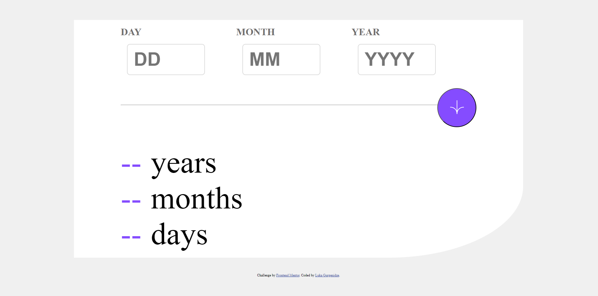

# Frontend Mentor - Age calculator app solution

This is a solution to the [Age calculator app challenge on Frontend Mentor](https://www.frontendmentor.io/challenges/age-calculator-app-dF9DFFpj-Q). Frontend Mentor challenges help me improve my coding skills by building realistic projects. 

## Table of contents

- [Overview](#overview)
  - [The challenge](#the-challenge)
  - [Screenshot](#screenshot)
- [My process](#my-process)
  - [Built with](#built-with)
  - [What I learned](#what-i-learned)
  - [Continued development](#continued-development)
- [Author](#author)

## Overview

### The challenge

Users should be able to:

- View an age in years, months, and days after submitting a valid date through the form
- Receive validation errors if:
  - Any field is empty when the form is submitted
  - The day number is not between 1-31
  - The month number is not between 1-12
  - The year is in the future
  - The date is invalid e.g. 31/04/1991 (there are 30 days in April)
- See hover and focus states for all interactive elements on the page

### Screenshot



## My process

### Built with

- Semantic HTML5 markup
- CSS custom properties
- Flexbox
-JavaScript

### What I learned

Bringing this project together allowed me to integrate multiple technologies seamlessly. It also helped me consolidate and reinforce all of my recent web development knowledge, sharpening my skills in combining different tools and techniques effectively.

```html
        <label class="inputLabel" for="day">DAY</label>
        <br>
        <input type="text" name="Day" id="day" placeholder="DD">
        <br>
        <label class="error-label" for="day" id="dayError"></label>
      </div>
```
```css
#wrapper {
    display: flex;
    flex-direction: column;
    justify-content: center;
    background-color: hsl(0, 0%, 100%);
    width: 1440px;
    height: 80vh;
    padding: 150px;

    border-end-end-radius: 30%;
}
```
```js
function getDate(){}
```

### Continued development 

I faced challenges in making the page fully responsive and wasn't able to complete it as intended. Moving forward, I’m eager to improve my skills in responsive web design and tackle similar issues more effectively in future projects.

**Note: Delete this note and the content within this section and replace with your own plans for continued development.**

## Author

- Frontend Mentor - [@RoundLuka](https://www.frontendmentor.io/profile/RoundLuka)
- Twitter - [@Luka Gurgenidze](https://x.com/RoundyLuka)
